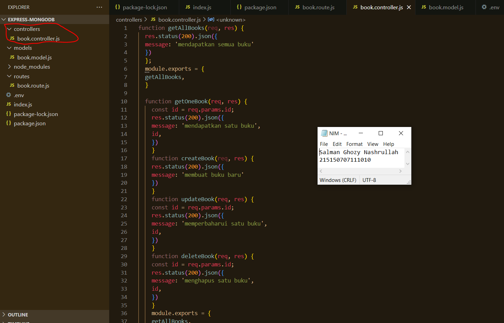
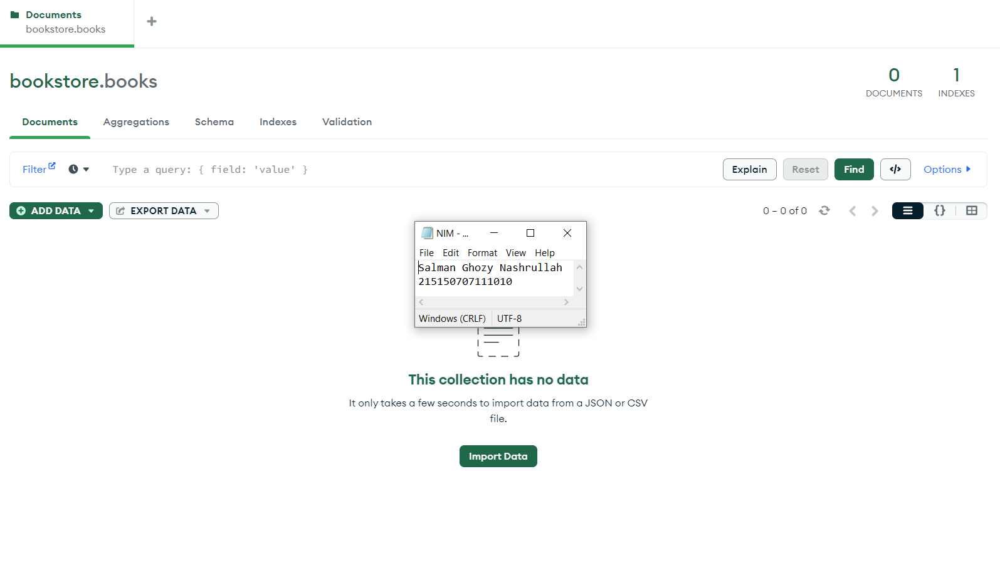

# Pemrograman-Integratif-A-Bab-3_215150707111010_Salman-Ghozy-Nashrullah

<h1>Langkah Percobaan</h1>
<h2>Percobaan instalasi NodeJS</h2>
<h3>Langkah ke-1</h3>

Buka halaman web nodeJS

<h3>Langkah ke-2</h3>

<i>Download</i> dan jalankan <i>node setup</i>

<h3>Langkah ke-3</h3>

Setelah instalasi selesai jalankan <i>command node -v</i> untuk memeriksa apakah <b>NodeJS</b> sudah terinstall

<h2>Percobaan instalasi NodeJS</h2>
<h3>Langkah ke-1</h3>

Lakukan pembuatan folder dengan nama <b>express-mongodb</b> dan masuk ke dalam folder tersebut lalu buka melalui <i>text editor</i> masing-masing

<h3>Langkah ke-2</h3>

Lakukan <i>npm init</i> untuk <i>mengenerate file package.json</i> dengan menggunakan <i>command npm init -y</i>

<h3>Langkah ke-3</h3>

Lakukan instalasi <i>express, mongoose,</i> dan <i>dotenv</i> dengan menggunakan <i>command npm i express mongoose dotenv</i>

<h2>Koneksi Express ke MongoDB</h2>
<h3>Langkah ke-1</h3>

Buatlah <i>file index.js</i> pada <i>root folder</i> dan masukkan kode <i>node index.js</i>

<h3>Langkah ke-2</h3>

Lakukan pembuatan <i>file .env</i> dan masukkan <i>PORT=5000</i>

Setelah itu ubahlah kode pada listening port menjadi berikut dan coba jalankan aplikasi kembali

<h3>Langkah ke-3</h3>

<i>Copy connection string</i> yang terdapat pada <i>compass</i> atau <i>atlas</i> dan <i>paste</i> kan pada <i>.env</i> seperti berikut

<h3>Langkah ke-4</h3>

Tambahkan baris kode berikut pada <i>file index.js</i> Setelah itu menjalankan aplikasi kembali 

<h2>Pembuatan routing</h2>
<h3>Langkah ke-1</h3>

Lakukan pembuatan direktori <i>routes</i> di tingkat yang sama dengan <i>index.js</i> dan membuat <i>file book.route.js</i> di dalamnya

<h3>Langkah ke-2</h3>

Membuat <i>file book.route.js</i> di dalamnya

<h3>Langkah ke-3</h3>

Menambahkan baris kode berikut untuk fungsi getAllBooks

<h3>Langkah ke-4</h3>

Melakukan hal yang sama untuk <i>getOneBook, createBook, updateBook,</i> dan <i>deleteBook</i>

<h3>Langkah ke-5</h3>

Melakukan <i>import book.route.js</i> pada <i>file index.js</i> dan tambahkan baris kode berikut

<h3>Langkah ke-6</h3>

Melakukan Uji salah satu endpoint dengan Postman

<h2>Pembuatan Controller</h2>
<h3>Langkah ke-1</h3>

Lakukan pembuatan direktori <i>controllers</i> di tingkat yang sama dengan <i>index.js</i> dan membuat <i>file book.controller.js</i> di dalamnya. Dan membuat baris kode dari routes untuk fungsi getAllBooks

<h3>Langkah ke-2</h3>

Lakukan langkah yang sama untuk operasi <i>getOneBook, createBook, updateBook, dan deleteBook.</i> Selanjutnya, impor <i>file book.controller.js</i> ke dalam file <i>book.route.js</i> dan modifikasi fungsi-fungsi tersebut agar dapat memanggil fungsi-fungsi yang ada di <i>book.controller.js.</i>

<h3>Langkah ke-3</h3>

Lakukan pengujian kembali, pastikan <i>response</i> tetap sama

<h2>Pembuatan Model</h2>
<h3>Langkah ke-1</h3>

Lakukan pembuatan direktori <i>models</i> di tingkat yang sama dengan <i>index.js</i> Setelah itu membuat <i>file book.model.js</i> di dalamnya Tambahkan baris kode berikut sesuai dengan tabel

<h2>Operasi CRUD</h2>
<h3>Langkah ke-1</h3>

Menghapus semua data pada collection books

<h3>Langkah ke-2</h3>

Melakukan import book.model.js pada file book.controller.js

<h3>Langkah ke-3</h3>

 melakukan perubahan pada fungsi createBook

<h3>Langkah ke-4</h3>

Membuatlah dua buah buku dengan data di bawah ini dengan Postman lakukan perintah <i>PUT</i> satu per satu

<h3>Langkah ke-5</h3>

Melakukan perubahan pada fungsi <i>getAllBooks</i>

<h3>Langkah ke-6</h3>

Melakukan perubahan pada fungsi <i>getOneBook</i>

<h3>Langkah ke-7</h3>

Menampilkan semua buku dengan Postman

<h3>Langkah ke-8</h3>

Menampilkan buku Dilan 1990 dengan Postman

<h3>Langkah ke-9</h3>

Melakukan perubahan pada fungsi updateBook

<h3>Langkah ke-10</h3>

Mengubah judul buku Dilan 1991 menjadi "Ghozy 1991" dengan Postman

<h3>Langkah ke-11</h3>

Melakukan perubahan pada fungsi deleteBook

<h3>Langkah ke-12</h3>

Hapus buku Dilan 1990 dengan Postman

